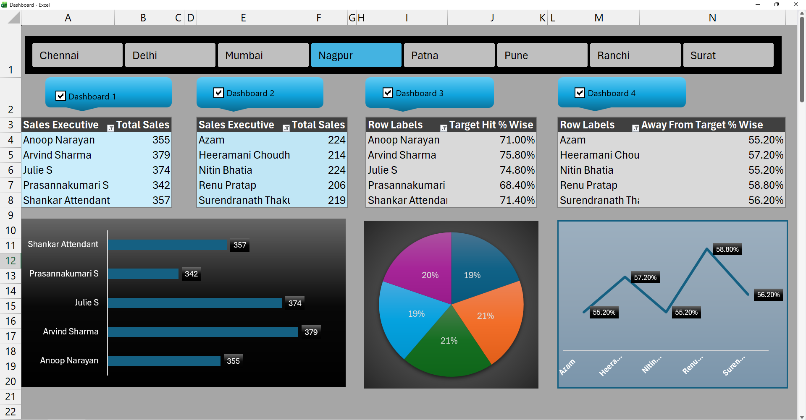
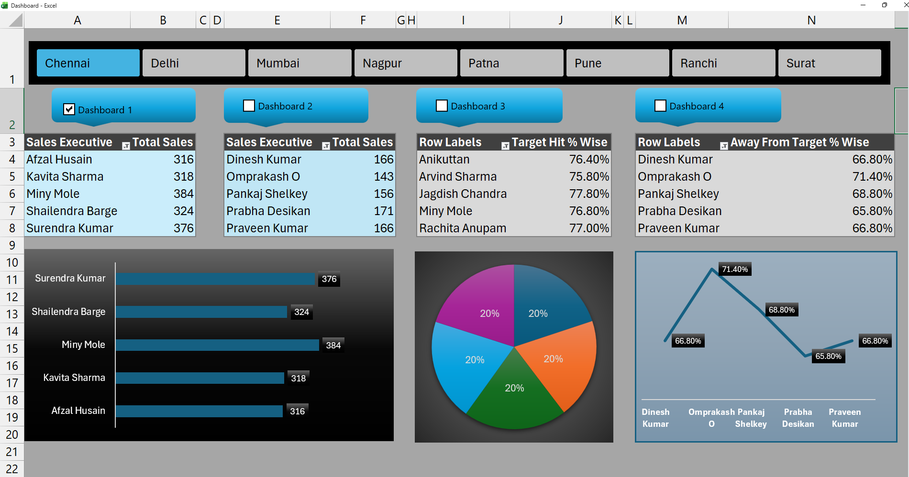

# 📊 Advanced Excel Sales Dashboard with VBA Automation

## 📌 Project Overview
This project is an interactive Sales Performance Dashboard built using Microsoft Excel with VBA automation.

It supports region-wise filtering, dashboard toggling, and automated calculations.

---

## 🖼 Dashboard Preview

### 🔹 All Dashboards Selected

### 🔹 Single Dashboard Selected

---

## 🛠 Tools & Technologies Used
- Microsoft Excel
- Pivot Tables
- Pivot Charts
- Slicers
- Form Control Checkboxes
- Conditional Formatting
- Macros
- VBA

---

## ⚙ Key Features
- Region selection buttons
- Multi-dashboard toggle system
- Target Hit % analysis
- Away From Target % comparison
- Dynamic chart updates using VBA

---

## 📁 File Included
Sales_Dashboard_VBA.xlsm

---

## 👤 Author
Mohd Monis  
Aspiring Data Analyst
